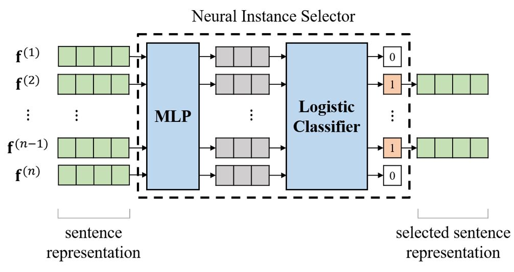
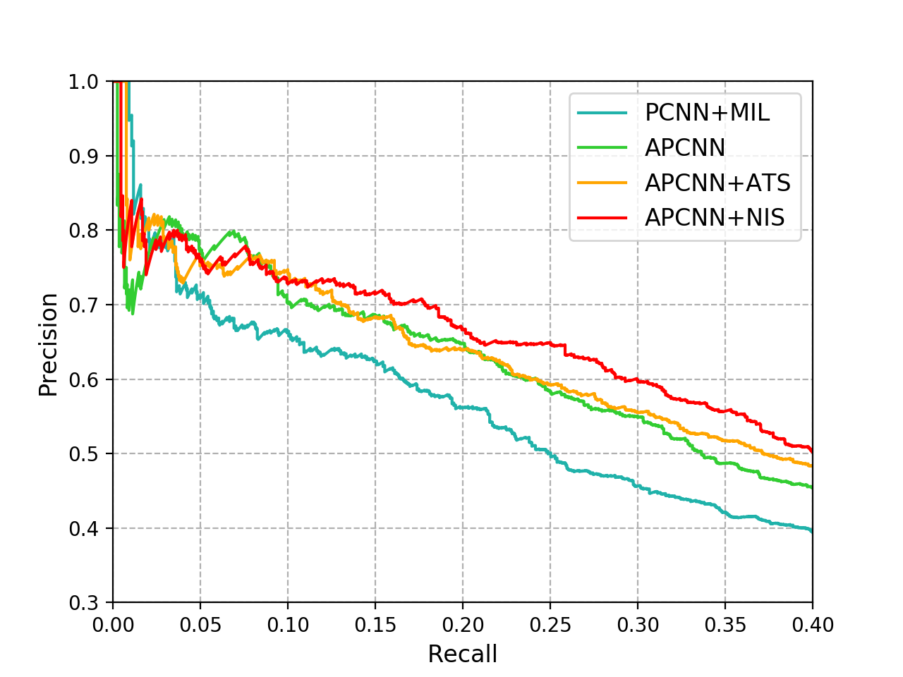
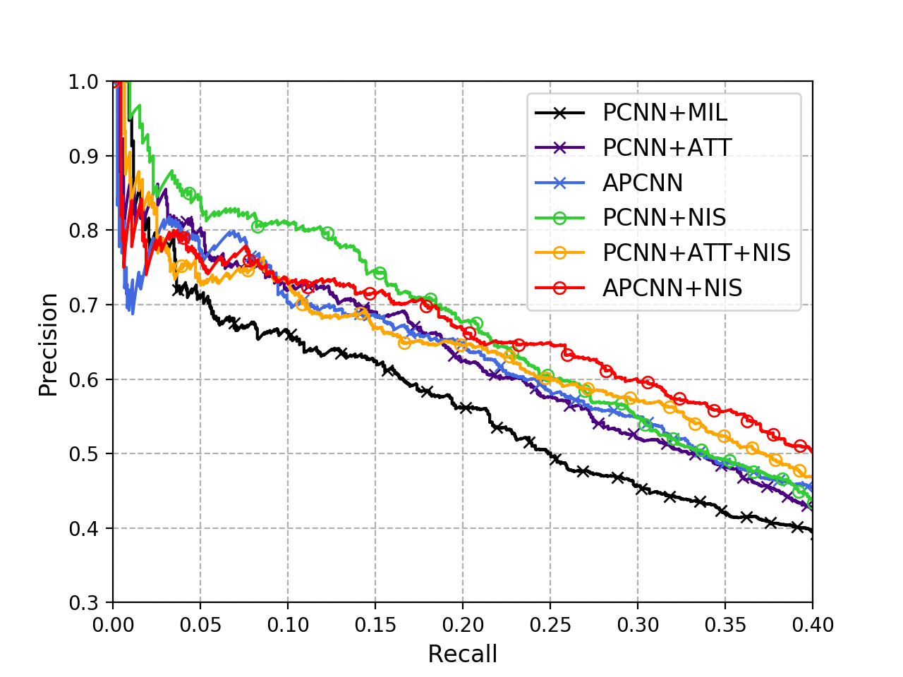
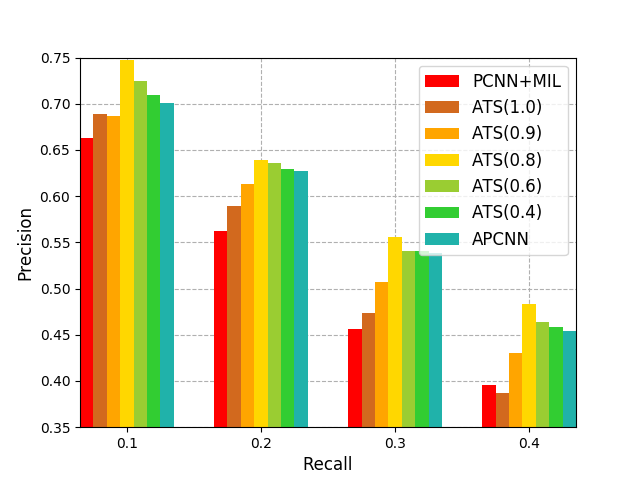

## Distant Supervision for Relation Extraction with Neural Instance Selector



## Citation

If you find our work useful in your research, please consider citing:

```
@inproceedings{chen2018distant,
  title={Distant Supervision for Relation Extraction with Neural Instance Selector},
  author={Chen, Yubo and Liu, Hongtao and Wu, Chuhan and Yuan, Zhigang and Jiang, Minyu and Huang, Yongfeng},
  booktitle={CCF International Conference on Natural Language Processing and Chinese Computing},
  pages={209--220},
  year={2018},
  organization={Springer}
}
```

## Introduction

This work is based on our [NLPCC 2018's paper](http://tcci.ccf.org.cn/conference/2018/papers/129.pdf). 

Distant supervised relation extraction is an efficient method to find novel relational facts from very large corpora without expensive manual annotation. However, distant supervision will inevitably lead to wrong label problem, and these noisy labels will substantially hurt the performance of relation extraction. Existing methods usually use multi-instance learning and selective attention to reduce the influence of noise. However, they usually cannot fully utilize the supervision information and eliminate the effect of noise. In this paper, we propose a method called Neural Instance Selector (NIS) to solve these problems. Our approach contains three modules, a sentence encoder to encode input texts into hidden vector representations, an NIS module to filter the less informative sentences via multilayer perceptrons and logistic classification, and a  elective attention module to select the important sentences. Experimental results show that our method can effectively filter noisy data and achieve better performance than several baseline methods.

In this repository we release code and data for our NIS module applied on three baseline models, as well as a few utility scripts for training and data pre-processing.

## Requirements

- Python: v3.6.7
- PyTorch: v0.4.1
- Numpy: v1.15.1
- Matplotlib: v3.0.0
- pickle, argparse

## Overview

We implement three baseline models: [PCNN+ONE](http://www.emnlp2015.org/proceedings/EMNLP/pdf/EMNLP203.pdf), [PCNN+ATT](http://www.aclweb.org/anthology/P16-1200), [APCNN](https://aaai.org/ocs/index.php/AAAI/AAAI17/paper/download/14491/14078). In our paper, we add NIS modules to them and evaluate the performance. Thus in this paper we release 6 models:

- [PCNN+ONE](models/pcnn_one.py): Implementation of PCNN with PyTorch.
- [PCNN+ATT](models/pcnn_att.py): Add bilinear attention to PCNN.
- [APCNN](models/apcnn.py): Add neural attention to PCNN.
- [PCNN+NIS](models/pcnn_nis.py): Add NIS module to PCNN, compared with PCNN+ONE.
- [PCNN+ATT+NIS](models/pcnn_att_nis.py): Add NIS module to PCNN+ATT model.
- [APCNN+NIS](models/apcnn_nis.py): Add NIS module to APCNN model.

Also we propose the ATS method to filter noise, which is aggregated with APCNN model.

### Performance Evaluation



### Effectiveness of NIS module



### Analysis of ATS threshold



## Usage

### Data preprocessing

The very first step is to preprocess the raw data by running the script:

```
chmod u+x preprocess.sh
./preprocess.sh
```

The script makes the ```data``` directory to store unzipped raw data files and the ```data/processed``` directory to store processed data files.

### Training

We provide the training scripts for all 6 models:
- [`scripts/run_pcnn_one.sh`](scripts/run_pcnn_one.sh)
- [`scripts/run_pcnn_att.sh`](scripts/run_pcnn_att.sh)
- [`scripts/run_apcnn.sh`](scripts/run_apcnn.sh)
- [`scripts/run_pcnn_nis.sh`](scripts/run_pcnn_nis.sh)
- [`scripts/run_pcnn_att_nis.sh`](scripts/run_pcnn_att_nis.sh)
- [`scripts/run_apcnn_nis.sh`](scripts/run_apcnn_nis.sh)

For example, if you want to train `PCNN+ONE` model, you can execute these commands:
```
cp scripts/run_pcnn_one.sh .
chmod u+x run_pcnn_one.sh
./run_pcnn_one.sh
```
All other models can be trained in the same way except for different script names.

### Evaluation

We provide `draw.py` to draw the precision-recall curve (the most popular evaluation metric for distant supervision relation extraction):
```
# change the file paths in draw.py
python3.6 draw.py
```


